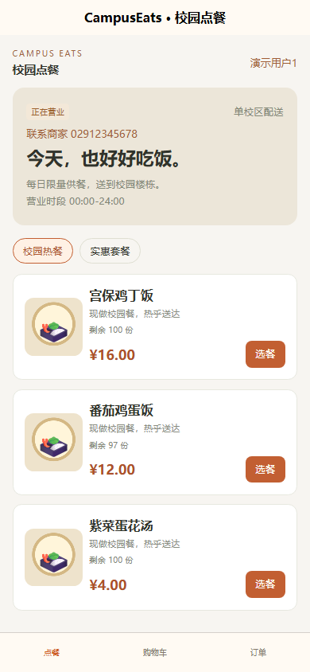
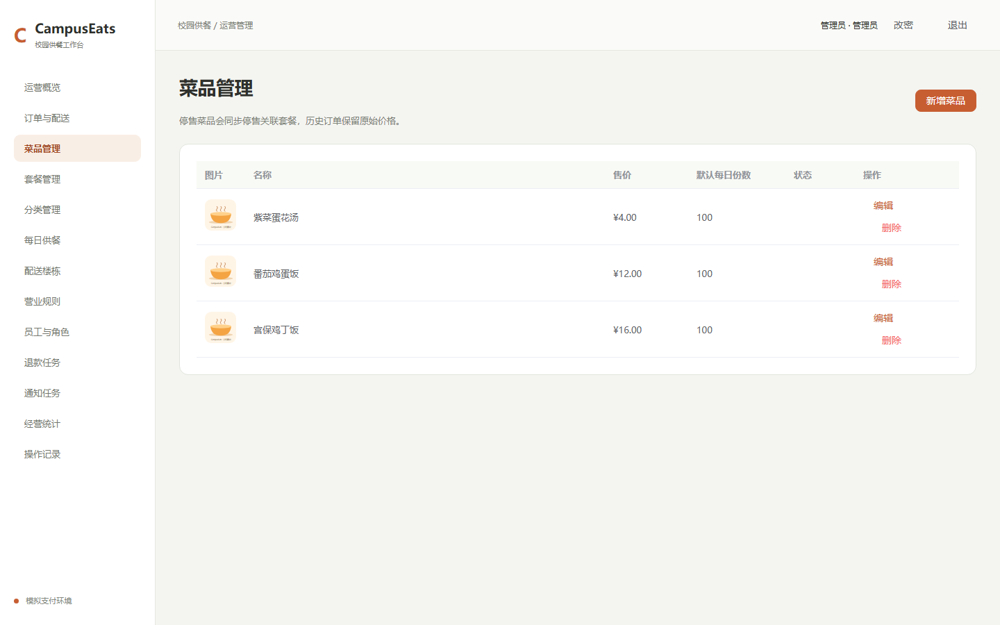
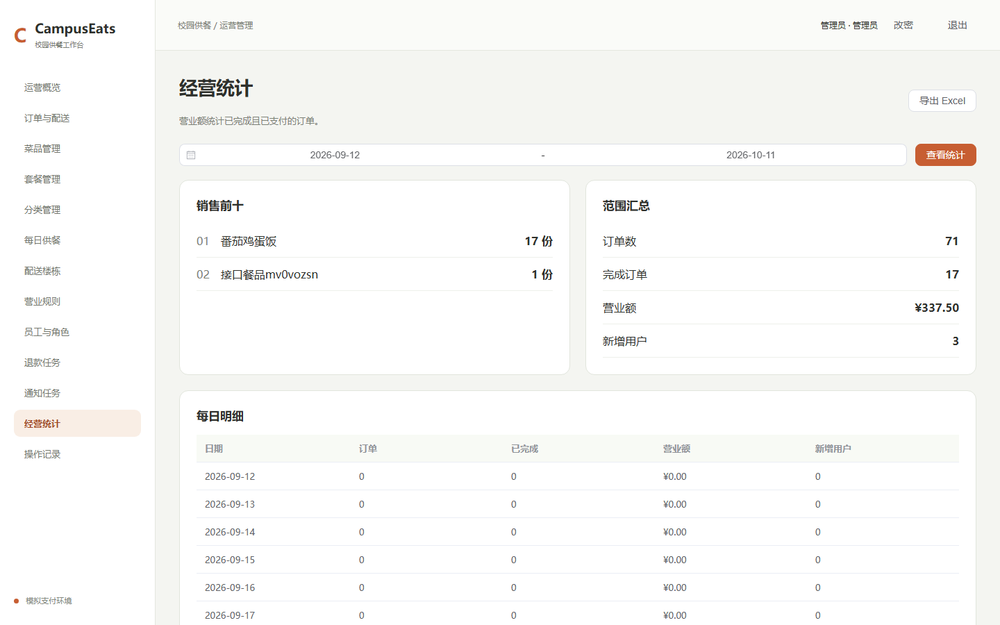
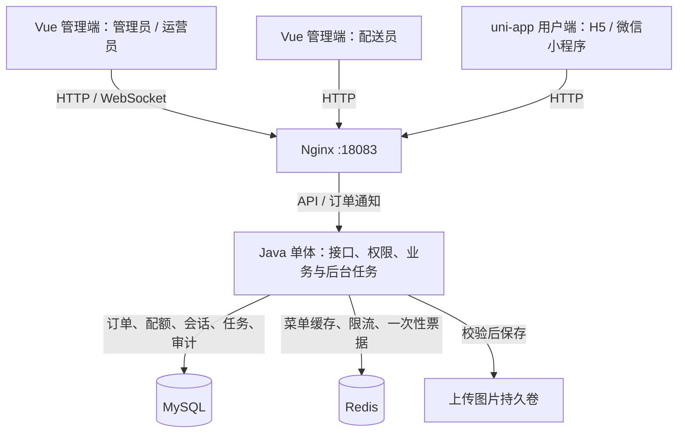

# CampusEats · 校园点餐与供餐管理

[](https://github.com/W205614/CampusEats/actions/workflows/verify.yml)

基于 Spring Boot、Vue 3 和 uni-app 的校园点餐应用。用户查看每日餐品、选择口味并下单，运营员接单和派单，配送员处理分配给自己的订单；管理员维护餐品、供餐份数、配送楼栋与营业规则。

项目面向**单校区、单店、单实例**工程演示，重点是订单、配额、退款任务和权限的一致性。**支付与退款均为模拟，不发生真实资金交易。**

[功能特点](#功能特点) · [界面预览](#界面预览) · [技术栈与架构](#技术栈与架构) · [快速开始](#快速开始) · [核心实现](#核心实现) · [项目结构与开发验证](#项目结构与开发验证) · [运行边界与文档导航](#运行边界与文档导航)

## 功能特点

| 使用者 | 功能 |
|---|---|
| 点餐用户 | 菜品与套餐、口味选择、每日剩余份数、购物车、楼栋地址、下单与模拟支付、订单查询与取消、再来一单 |
| 运营员 | 订单查询、接单备餐、拒单、接单前及备餐中取消、派单；不能开始配送或确认送达 |
| 配送员 | 只查看和操作分配给自己的订单，开始配送、确认送达 |
| 管理员 | 分类、菜品、套餐与图片，默认及当日配额，楼栋启停，营业时段与费用，员工角色，退款和通知任务，审计查询与 XLSX 统计导出 |

供餐按菜品计数，套餐占用组成菜品的份数。下单保存当时的商品、费用和地址快照；菜单改价或删除地址不会改写历史订单。管理员和运营员订单页使用 WebSocket 并每 15 秒查询；配送员与点餐用户订单页使用定时查询。配送超时只标记待处理，不自动视为送达。

## 界面预览

以下截图于 **2026-10-11** 从本机运行版本截取，展示演示数据；统计数字不代表真实营业结果。H5 截图不代表微信真机验收。

### 用户端点餐



### 管理端菜品维护



### 经营统计



## 技术栈与架构

| 部分 | 技术 | 职责 |
|---|---|---|
| 业务后端 | Java 21、Spring Boot 4.1.1、Spring Security、MyBatis / JDBC、Flyway | 接口、权限、计价、交易、配额、迁移及后台任务 |
| 持久化与缓存 | MySQL 8.4、Redis 7.4 | MySQL 保存业务事实；Redis 提供菜单缓存、限流和一次性连接票据 |
| 管理端 | Vue 3、TypeScript、Element Plus、Vite | 运营工作台与角色入口 |
| 用户端 | uni-app、Vue 3、TypeScript | H5 与微信小程序源码及构建 |
| 部署与验证 | Docker Compose、Nginx、JUnit、Testcontainers、Playwright、GitHub Actions | 源码构建、回归、页面验收与部署检查 |



日常 Compose 包含 `mysql`、`redis`、`server`、`web` 四个容器，默认仅 Nginx 绑定宿主机 `127.0.0.1:18083`。管理端与 H5 使用同源接口；小程序需要配置设备可访问的 HTTPS 地址。

Controller 处理协议与参数校验，业务服务处理权限、状态和事务。MyBatis 负责订单、目录的批量读取，JDBC 明确执行条件更新与行锁，共用数据源和 Spring 事务。退款及 Outbox 任务运行在同一个 Java 服务中，不额外部署消息队列。

## 快速开始

### 1. 准备环境并启动

需要 Docker Desktop / Linux Engine 与 Compose；默认启动脚本还需要 Java 21、Maven 和 PowerShell 7。本地前端开发及独立构建脚本需要 Node.js 24 与 npm，CI 使用 Node.js 24.19.0。

在仓库根目录执行：

```powershell
./scripts/start.ps1
docker compose ps
```

首次运行会从 `.env.example` 生成本机 `.env` 和独立的演示管理员密码，执行后端测试，再从源码构建并启动四个容器。首次下载依赖与构建镜像需要网络。

### 2. 访问演示环境

| 入口 | 地址 / 账号 |
|---|---|
| 管理端 | http://localhost:18083/admin/ |
| H5 用户端 | http://localhost:18083/app/ |
| 管理员 | `admin`，初始密码见本机 `.local/demo-credentials.txt` |
| 点餐用户 | 在 H5 登录页选择三个相互独立的演示账户之一 |

首次默认关店。在管理端“营业规则”确认费用和时段后打开营业开关；管理员创建运营员、配送员账户后，可用对应角色登录工作台。

演示登录仅在 `demo` profile 启用。修改 `.env` 的初始密码不会重置已有管理员；已有旧 MD5 密码在成功登录后迁移，并要求改密。`.env` 和本机凭据不提交 Git。

### 3. 常用操作

```powershell
docker compose logs --tail 100 server web
docker compose stop
docker compose up -d --wait
```

停止再启动继续使用原持久卷。更新源码后使用启动脚本重建；脚本会为当时的旧应用镜像保留回滚标签。数据库迁移涉及的回退需结合已验证备份，不能只切换镜像。

## 核心实现

### 重复提交与响应丢失

下单前由服务端生成报价，提交携带 `cartVersion`、`quoteHash` 和 `Idempotency-Key`。数据库对用户与请求键建立唯一约束；同键同内容返回原订单，同键换内容返回冲突。购物车版本防止并发修改被覆盖，报价变化要求用户重新确认。

客户端无法确认提交是否成功时，保留原请求键，通过 `orders/by-request/{key}` 查询；未找到才以原键和原请求重试。订单、快照、配额流水、购物车清理、审计和 Outbox 在同一事务中提交。

### 每日配额与取消规则

配额按营业日期和菜品维护，套餐先合并组成数量，再按菜品 ID 顺序处理。数据库条件更新限制可用份数，订单与配额变更共享事务，避免并发超卖或失败后留下孤立扣减。

下单预占、接单转消耗；接单前取消、拒单及支付超时释放预占。用户仅能取消待支付或待接单订单；管理员和运营员还可取消备餐中订单，此时不自动返还已消耗份数。配送中订单不支持取消。释放依据原配额流水的营业日期，跨午夜也不会返还到错误日期。

### 退款任务与中断恢复

已支付订单取消后创建持久化模拟退款任务，不直接标记退款完成。后台任务带租约和领取标识，失败有限重试，达到上限后由管理员重试；过期租约可以重新领取。仅在模拟网关成功并更新数据库后，订单才进入已退款状态。

这是本项目模拟支付链路的恢复机制；真实支付网关的对账、回调与资金验收不在当前范围。

### 缓存和实时连接异常

目录变更在事务中写入缓存失效 Outbox，提交后立即尝试删除相关缓存，后台任务在重试限额内补偿失败，达到失败上限后需管理员处理。单实例内用固定分片读写锁协调回填与失效，避免旧查询在失效完成后重新写回旧菜单；最终下单仍以数据库校验为准。

Redis 不可用时菜单回源数据库，受回源并发上限约束，繁忙时返回拒绝响应；限流转入本机有界窗口。仅管理员和运营员使用 WebSocket 与一次性票据，Redis 故障时无法新建连接，但订单页继续定时查询。通知 Outbox 成功表示本机发送队列接收，不能据此确认客户端收到；管理端按 `eventId` 去重并重查订单列表。用户端和配送员不订阅 WebSocket。

### 权限和会话撤销

服务端检查用户数据归属、员工角色和配送订单分配关系。每次请求校验账户状态及数据库会话，注销、改密或角色 / 启用状态变更撤销旧会话。前端隐藏入口只改善交互，不能代替服务端授权。

WebSocket 校验允许的 Origin 和短期一次性票据，拒绝票据重放。业务 JSON 响应使用 `code/message/data/requestId`；金额和长整型 ID 使用字符串，减少两端序列化差异。XLSX 导出返回二进制文件，不套用 JSON 响应封装。

## 项目结构与开发验证

### 项目结构

```text
CampusEats/
├── sky-common/                  # 公共异常与哈希工具
├── sky-pojo/                    # 请求、响应及校验契约
├── sky-server/
│   └── src/
│       ├── main/java/com/sky/
│       │   ├── web/             # HTTP 接口与异常响应
│       │   ├── security/        # 认证、会话、权限与限流
│       │   ├── business/        # 购物车、报价、订单、配额及后台任务
│       │   ├── mapper/          # MyBatis 批量读取
│       │   ├── infra/           # 数据库、序列化、种子数据等基础设施
│       │   └── websocket/       # 票据与订单通知
│       ├── main/resources/db/migration/ # Flyway 增量迁移
│       └── test/                # 数据库集成与缓存、限流回归
├── frontend/
│   ├── admin/                   # Vue 管理端与 Playwright 流程
│   ├── client/                  # uni-app 用户端
│   └── contracts/               # OpenAPI、生成类型、展示映射与共享 ApiError
├── deploy/                      # Web 镜像、Nginx 与演示图片
├── scripts/                     # 构建、验收、备份、恢复及可选压测
├── docs/                        # 架构、运行手册、截图与验收记录
└── compose.yaml                 # 四服务部署与持久卷
```

三个 Maven 模块及业务服务边界保留，不引入通用 CRUD 框架。两端共享契约与 `ApiError`，各自保留 `fetch`、`uni.request` 和会话处理。旧实现与无引用资源已移出当前目录，可通过[整理前提交](https://github.com/W205614/CampusEats/tree/f85f3e7faf36b9ef3bd8d6e4a58c33155b3a18e8)追溯；Flyway 迁移保留。

### 本地开发

```powershell
./scripts/build-frontends.ps1
```

演示容器已启动时，可通过 Nginx 复用后端。先在本机开发用 `.env` 的 `ALLOWED_ORIGINS` 中保留原来源并追加 `http://127.0.0.1:5173,http://127.0.0.1:5174`，执行 `docker compose up -d --wait server` 使配置生效。否则开发页面请求及 WebSocket 会被来源校验拒绝；开发来源只用于本机开发配置。

随后在两个终端分别设置代理并启动开发服务器：

```powershell
$env:API_PROXY='http://localhost:18083'
npm run dev --prefix frontend/admin
```

```powershell
$env:API_PROXY='http://localhost:18083'
npm run dev:h5 --prefix frontend/client
```

构建脚本安装锁定依赖，执行用户端类型检查及管理端、H5、小程序构建；管理端 build 自带类型检查。未设置 `API_PROXY` 时，开发代理默认连接本机 `8080`，需单独运行本地后端；默认 Compose 不发布该端口。

小程序构建产物为 `frontend/client/dist/build/mp-weixin`，用微信开发者工具导入。AppID、设备可访问的 HTTPS 后端及合法请求域名配置见[部署手册](docs/v1-deployment.md#微信小程序)。

### 自动化验证

```powershell
mvn -B -ntp verify
./scripts/build-frontends.ps1
npx --prefix frontend/admin playwright install chromium
npm run test --prefix frontend/admin
./scripts/smoke.ps1
node scripts/check-websocket.mjs
node scripts/generate-contracts.mjs --fetch
git diff --exit-code -- frontend/contracts/openapi.json frontend/contracts/openapi.ts
```

后端数据库集成测试用 Testcontainers 创建独立 MySQL / Redis，缓存和限流隔离测试使用替身及受控并发。浏览器、烟测、WebSocket 及运行中契约比较需要已启动的本机演示环境；`--fetch` 会更新契约文件，上面的差异检查用于发现接口变化。

| 测试层 | 当前执行数（含参数化展开） | 验证职责 |
|---|---|---|
| 真实数据库集成 | 39 | 37 项业务回归 + 2 项迁移：幂等、配额竞争、状态、事务、权限与数据保留 |
| 隔离回归 | 8 | 3 项缓存竞态 + 5 项限流边界与并发计数 |
| Chromium 页面 | 10 条流程 | 送达、退款、响应丢失恢复、商品与套餐、菜单联动、营业 / 配额、地址 / 购物车、两种员工角色、统计下载与查询 |
| 部署与协议检查 | 独立脚本 | 入口跳转与端口、鉴权、WebSocket 安全、运行中 OpenAPI 比较 |

同一功能的事务测试和页面测试验证不同风险，不按数量压缩。浏览器辅助代码在 `frontend/admin/tests/helpers.ts`，保持单 worker，记录营业配置与原默认地址；涉及演示用户的流程要求原购物车为空。测试资源独立命名，`finally` / `afterEach` 在失败后也尝试恢复配置、清理自己的地址和购物车、取消未完成测试订单并等待退款、停用测试员工 / 楼栋，保留业务历史与审计。

这些收尾调用依赖接口可用，不是数据库回滚，也不保证任意失败后全部恢复。配送中订单不能取消，进程中断、接口故障或清理失败时需检查残留并人工收尾；独立命名也不代表支持多套测试并行操作共享演示账户。

### 最新验收摘要

**2026-10-11，代码整理提交 `8ce4f15` 的本机验收：**

| 检查 | 结果 |
|---|---|
| 后端 | 修改前、修改后均 47 项通过，失败 / 错误 / 跳过均为 0 |
| 页面与构建 | Chromium 10/10；管理端、H5、小程序构建及两端类型检查通过 |
| 接口与安全 | 运行中 OpenAPI 比较、WebSocket Origin / 单次票据 / 重放检查及烟测通过 |
| 容器与数据 | 四个容器健康；独立备份恢复通过；重启后业务表校验和与上传文件哈希一致，归属、孤立记录及配额检查通过 |
| GitHub CI | [代码整理提交 `8ce4f15`](https://github.com/W205614/CampusEats/actions/runs/38108301733)及 [README 重写提交 `7d416c2`](https://github.com/W205614/CampusEats/actions/runs/38110885793)的工作流均成功 |

首轮浏览器为 **8 项通过、2 项失败**，集中登录触发既有限流。修正测试辅助逻辑后，仅对明确的 `RATE_LIMITED` 响应等待窗口恢复，其他错误仍失败；生产限流未放宽，最终完整流程通过。详细过程与旧镜像清理状态见[本次整理验收](docs/cleanup-verification-20261011.md)。

以上本机结果对应 `8ce4f15`；后续 `7d416c2` 只更新 README 和截图，业务源码及测试未变，CI 重跑后端、前端构建、容器启动、页面及协议检查均通过。CI 不执行备份恢复、容量压测或完整故障演练；这些不能由 CI 成功推导。本次 README 审查未重新执行本机全套业务验收，历史负载、数据集及结果见[一致性与恢复验收](docs/consistency-verification-20261007.md)。徽章展示 `master` 工作流状态，具体结果以对应提交为准。

## 运行边界与文档导航

- 单校区、单店、单 Java 实例，不包含多商户结算、跨主机高可用或水平扩容验收。
- 支付 / 退款为模拟；微信开发者工具预览、真机及真实微信登录尚未验收。小程序编译成功不能替代真机结果。
- 实时通知是尽力发送，数据库订单状态是事实来源；配送超时需要人工处理。
- 2026-10-11 对锁定依赖执行 `npm audit`：管理端 0；用户端 7 高危、9 中危、10 低危。高危项仅在指定构建场景按限定范围接受至 2026-11-07，不代表零漏洞或未来审计结果不变。约束与复查入口见[依赖安全记录](docs/frontend-security-review.md)。

数据库、上传文件和私有配置需成套备份，再恢复到独立临时环境核对。备份包含敏感数据，不提交 Git。已有数据库迁移必须先备份、检查冲突并在恢复克隆中显式验证 Flyway 基线，应用不自动接管未知非空数据库。

```powershell
./scripts/backup.ps1
./scripts/restore-check.ps1 -BackupDirectory E:/project/CampusEats/.local/backups/具体备份目录
```

故障演练 `./scripts/recovery-check.ps1` 会短暂中断本机演示依赖；容量测试 `./scripts/load.ps1` 使用独立项目和固定数据集。这些按需运行，详细步骤见部署与验收文档。

当前演示保留 `campuseats-v1` 四个服务及业务持久卷。2026-10-11 按用户选择删除旧应用镜像和历史回滚标签，数据备份继续保留；后续启动脚本重建仍会保留当时镜像。清理必须按项目、镜像引用与挂载核对，禁止全局 prune 或对业务项目执行 `docker compose down -v`。[旧容器整理脚本](scripts/consolidate-containers.ps1)要求通过 `-VerifiedBackupDirectory` 提供已独立恢复验证的本机 `.local` 备份，并检查项目范围和停止状态；它不负责删除旧镜像。

| 文档 | 内容 |
|---|---|
| [架构与接口约定](docs/v1-architecture.md) | 交易、任务、权限、缓存和接口协议 |
| [部署、迁移与恢复](docs/v1-deployment.md) | 本机部署、小程序配置、旧库迁移、备份及演练 |
| [2026-10-11 整理与验收](docs/cleanup-verification-20261011.md) | 删除与合并内容、测试修正、数据核对及 Docker 清理 |
| [一致性与降级恢复验收](docs/consistency-verification-20261007.md) | 历史并发、缓存竞态、恢复和容量证据 |
| [实施与验收记录](docs/v1-verification.md) | 历史实施、构建及运行证据 |
| [依赖安全记录](docs/frontend-security-review.md) | 前端依赖约束、风险例外与审计命令 |
| [原始审查](docs/enterprise-review-20261007.md) | 历史问题及后续整改背景 |

历史文档中的路径、指标和实现以其注明的提交为准。

