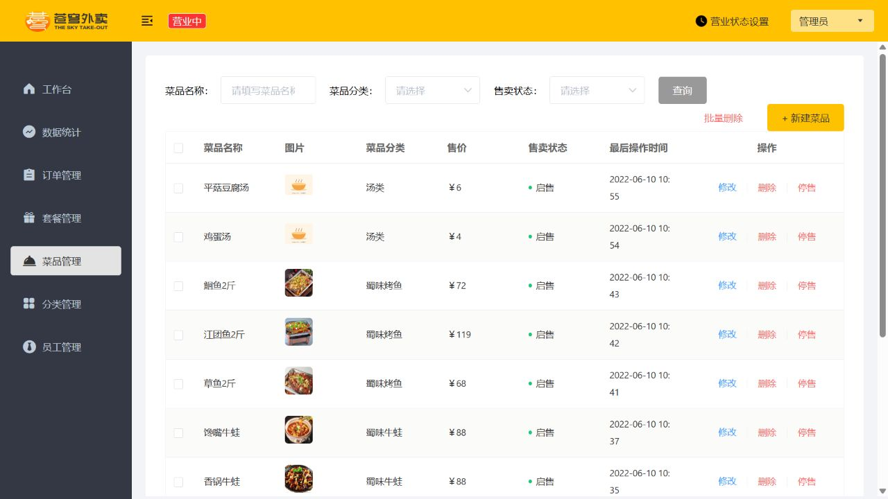

# CampusEats

基于 Spring Boot、MyBatis 和 Redis 的校园外卖项目，包含管理端及微信小程序用户端接口，覆盖菜品/套餐、购物车、地址、订单、消息通知和运营统计。配套 Docker Desktop 部署及功能测试脚本，当前交付范围为**本机演示环境**：默认共享演示用户、模拟支付与退款、本地图片上传，真实资金交易尚未接通。

## Docker Desktop 本地运行

### 环境和课件资源

- Docker Desktop 已启动，使用 Linux 容器模式。
- PowerShell 7 和 Node.js；Node.js用于应用管理端及小程序的编译代码补丁。
- 本机使用 JDK 21、Maven完成过构建验证。启动脚本优先使用本机Maven，没有Maven时使用Maven容器构建；Java运行容器采用Temurin 21 JRE。
- 配套课件的`资料`目录，包含下列资源。**管理端`deploy/admin`和小程序`mp-weixin`编译文件不入Git**，需要先从课件生成；Java代码、初始化SQL、示例图片、补丁脚本和测试文档已包含在仓库中。

| 资源 | 相对课件`资料`目录的路径 |
| --- | --- |
| 管理端 | `day01\前端运行环境\nginx-1.20.2\html\sky` |
| 初始数据库 | `day01\数据库\sky.sql` |
| 菜品照片 | `day03\图片资源` |
| 微信小程序 | `day06\微信小程序代码\mp-weixin` |

### 首次启动

```powershell
git clone https://github.com/W205614/CampusEats.git
cd CampusEats

# 将路径替换为你的课件“资料”目录；只生成项目内副本，原课件不变
pwsh -NoProfile -File scripts/prepare-assets.ps1 -CourseRoot 'D:\你的课件目录\资料'
pwsh -NoProfile -File scripts/start.ps1
```

已在本机`E:\project\CampusEats`准备好资源时，直接运行`start.ps1`即可。默认课件路径写在`prepare-assets.ps1`中；资源缺失且路径不同的环境，应先按上面的命令指定`CourseRoot`。

打开 [管理端](http://localhost:18083)，默认账号 `admin`，密码 `123456`；[接口文档](http://localhost:18083/doc.html)。Docker Desktop 中项目分组为 `campuseats`，包含 MySQL、Redis、Java 服务和 Nginx。默认只监听本机。

微信开发者工具导入项目内 `mp-weixin`，接口地址已设为 `http://localhost:18083`。这是微信小程序编译产物，需要微信运行环境。Docker 默认启用一个共享演示用户、模拟支付、本地图片上传，并跳过百度配送校验。

完整说明见 [Docker 部署与小程序接入](docs/docker-deployment.md)，审查结果见 [项目审查](docs/project-review.md)。首次运行会生成不入库的 `.env` 和随机基础设施/JWT 密钥。课件前端位于 `deploy/admin`，原始课件保持不变。

### 日常操作

```powershell
docker compose ps
docker compose logs --tail 100 server
docker compose stop
docker compose start
# 修改Java代码后，重新构建、执行回归测试并更新容器
pwsh -NoProfile -File scripts/start.ps1
```

MySQL、Redis和上传图片分别使用持久卷；初始化SQL只在全新MySQL数据卷执行。已有数据卷升级的处理见部署文档。不要使用`docker compose down -v`作为常规重启操作。

## 本次修复与验证

| 问题 | 当前行为 |
| --- | --- |
| 菜品调价/停售后，用户菜单继续读取旧缓存 | 清理正确的菜品缓存；停售菜品同步清理关联套餐缓存 |
| 打烊、停售商品或旧购物车价格仍可能提交订单 | 服务端检查营业状态、商品状态及当前价格，失败保留购物车并给出提示 |
| 支付依赖服务内最近订单，重启或连续下单可能改错订单 | 按订单号和当前用户支付，条件更新限制状态，重复支付不重复通知 |
| 完成订单可能被重新接单，未支付订单商家取消失败 | 按期望状态更新接单、拒单、取消、派送、完成及定时任务 |
| 地址/订单未检查归属，员工禁用后旧令牌仍可访问 | 用户数据归属校验、请求结束清理用户上下文、员工启用状态校验 |
| 修改密码入口缺少接口，非法输入或缺失实体返回500 | 补齐当前账号修改密码与常见参数、实体、状态检查 |
| 请求失败无清楚反馈，下单/支付按钮无法恢复 | 两端设15秒请求超时，补中文提示、失败恢复与重复点击拦截 |
| 示例图、支付与报表说明不清，窄窗口按钮超出屏幕 | 补课件菜品照片，明确模拟支付和近30日导出范围，调整桌面布局及资源缓存版本 |

2026-10-06在本地修改后的工作区完成以下验证，详细结果与未验证范围见 [功能与体验测试记录](docs/functional-ux-review.md)。各层检查存在覆盖重叠，不能作为生产质量或并发能力指标。

| 验证 | 结果 |
| --- | --- |
| Java回归测试 | 24项通过，0失败/错误/跳过 |
| 实际HTTP功能检查 | 58项通过，独立业务测试数据已清理 |
| 小程序请求与按钮逻辑 | 17项通过，使用模拟的微信运行API |
| 管理端请求逻辑 | 6项通过 |
| 容器端到端 | 重启保留订单、指定订单模拟支付、重复支付、WebSocket、商家完成、取消和上传通过 |
| 管理端浏览器体验 | 登录、表单校验、搜索空结果与恢复、图片、统计、服务故障提示及恢复通过 |



### 复测

```powershell
mvn -B -ntp verify
# 验证实际下单、模拟支付、WebSocket、商家完成和图片上传；会留下演示订单
pwsh -NoProfile -File scripts/smoke.ps1 -BaseUrl http://127.0.0.1:18083 -VerifyRestart
# 常见异常、CRUD、缓存和订单状态；创建并清理独立测试数据
pwsh -NoProfile -File scripts/functional.ps1
node scripts/test-miniprogram.cjs
node scripts/test-admin.cjs
```

功能检查要求演示登录与模拟支付启用、共享演示购物车为空；不会修改原管理员密码，会恢复原营业状态及默认地址。小程序逻辑测试不能替代微信开发者工具和真机验收。报表API已验证XLSX文件，内置浏览器未回传blob下载完成事件，最终文件落盘仍需在实际使用的浏览器核对。

## 当前边界

- 微信小程序是uni-app编译产物，需微信开发者工具/微信运行环境，不能直接作为浏览器H5页面访问；AppID权限及真机尚未验收。
- `DEMO_ENABLED=true`使用同一个共享演示身份；`MOCK_PAYMENT_ENABLED=true`只更新本地状态，不涉及资金。关闭模拟支付会拒绝支付接口，不会开启真实支付。
- 默认跳过百度配送检查；真实微信登录、百度配送、外部OSS与真实支付退款还需配置并验证。
- 默认仅绑定`127.0.0.1`。WebSocket未鉴权、员工密码使用MD5且种子密码简单，当前配置不能直接开放公网业务。
- 订单状态条件更新已覆盖本次验证路径，尚未完成多实例并发、真实支付回调、退款重试和服务端下单幂等验收。
- 管理端和小程序缺少原始前端工程，当前补丁用于本地课件演示；长期产品开发需取得源工程。

文档入口：[部署与小程序接入](docs/docker-deployment.md) · [项目审查](docs/project-review.md) · [功能与体验验收](docs/functional-ux-review.md) · [首次部署记录](docs/local-verification.md)。

---

## 技术栈

| 分类 | 技术 |
| --- | --- |
| 后端框架 | Spring Boot 2.7.3、MyBatis、MyBatis PageHelper |
| 数据存储 | MySQL、Redis |
| 安全与鉴权 | JWT（jjwt 0.9.1）、Spring MVC 拦截器 |
| 接口文档 | knife4j（Swagger UI 增强版） |
| 第三方集成 | 微信小程序登录、微信支付（wechatpay-apache-httpclient）、阿里云 OSS |
| 实时推送 | WebSocket |
| 工具库 | Lombok、Fastjson、Apache POI（报表导出）、Druid 连接池、commons-lang |
| 构建工具 | Maven（多模块工程） |

---

## 项目结构

Maven 多模块工程，三个模块依赖关系：`sky-common` ← `sky-pojo` ← `sky-server`。

```
campus-eats
├── pom.xml                         # 父 POM，统一依赖管理
├── compose.yaml                    # MySQL、Redis、Java、Nginx及持久卷
├── Dockerfile                      # Java运行镜像，复制已验证的JAR
├── deploy                         # 初始化SQL、Nginx、示例图片和管理端补丁
├── scripts                        # 资源准备、启动、前端补丁与功能/烟测
├── docs                           # 部署、审查、验收记录与截图
├── mp-weixin                      # 从课件生成的小程序副本（不入Git）
├── sky-common                     # 公共模块：通用工具、常量、异常、结果封装
│   └── src/main/java/com/sky
│       ├── constant                # 常量（状态、JWT Claims、消息、密码等）
│       ├── context                 # BaseContext 线程上下文（保存当前登录用户 id）
│       ├── enumeration             # 枚举（如操作类型）
│       ├── exception               # 自定义异常体系（BaseException 及其子类）
│       ├── json                    # Jackson 序列化配置
│       ├── properties              # 配置属性（Jwt、阿里 OSS、微信）
│       ├── result                  # 统一返回（Result、PageResult）
│       └── utils                   # 工具类（Jwt、阿里 OSS、HttpClient、微信支付）
├── sky-pojo                       # 实体/传输对象模块
│   └── src/main/java/com/sky
│       ├── dto                     # 数据传输对象（登录、菜品、订单、套餐、购物车等）
│       ├── entity                  # 数据库实体（Employee、Dish、Orders、User 等）
│       └── vo                      # 视图对象（给前端/接口返回的数据）
└── sky-server                     # 服务端模块（唯一可运行的模块，含启动类）
    └── src/main
        ├── java/com/sky
        │   ├── annotation          # 自定义注解（如 @AutoFill 公共字段自动填充）
        │   ├── aspect              # AOP 切面（AutoFillAspect 自动填充创建/更新时间等）
        │   ├── config              # 配置类（OSS、Redis、WebMvc、WebSocket）
        │   ├── controller          # 控制器
        │   │   ├── admin           # 管理端接口（员工、分类、菜品、套餐、订单、报表等）
        │   │   ├── user            # 用户端接口（用户、购物车、下单、地址簿等）
        │   │   └── notify          # 支付回调通知接口
        │   ├── handler             # 全局异常处理
        │   ├── interceptor         # JWT 登录校验拦截器（admin / user 双端）
        │   ├── mapper              # MyBatis Mapper 接口
        │   ├── service             # 业务层（接口 + impl 实现）
        │   ├── task                # 定时任务（订单超时处理、WebSocket 定时消息）
        │   ├── websocket           # WebSocket 服务端
        │   └── SkyApplication.java # 启动类
        └── resources
            ├── application.yml     # 主配置
            ├── application-dev.yml # 开发环境配置（已 gitignore，不入库）
            ├── application-docker.yml # Docker环境配置，通过环境变量注入密钥
            └── mapper              # Mapper.xml（手写 SQL）
```

---

## 功能特性

### 管理端（admin）

- **员工管理**：登录、退出、分页查询、启用/禁用、编辑、修改密码
- **分类管理**：菜品/套餐分类的增删改查与分页查询
- **菜品管理**：新增、分页查询、删除、批量起售/停售、编辑；含口味（DishFlavor）管理
- **套餐管理**：套餐与菜品关联（SetmealDish）、起售/停售、分页查询
- **订单管理**：条件分页查询、各状态订单数量统计、接单、拒单、取消、派送、完成、催单（WebSocket 通知）
- **数据统计**：运营数据报表（营业额、订单、菜品销量、用户数）、导出 Excel 报表（POI）
- **工作台**：今日运营数据概览、待办事项（待接单/待派送/已派送订单数）
- **店铺营业状态**：设置/查看营业状态（Redis 存储）
- **文件上传**：Docker默认本地存储及持久卷，保留可配置的阿里云OSS路径

### 用户端（user / C 端）

- **用户登录**：Docker默认共享演示身份并签发JWT；关闭演示模式后使用微信code换取身份，真实集成待验收
- **浏览点餐**：按分类浏览菜品、查看套餐及所含菜品（DishItemVO）
- **购物车**：加入/删除/清空/查看购物车
- **下单支付**：提交订单、本地模拟支付、查看订单历史；微信支付工具与回调代码需进一步接通和验证
- **地址簿**：新增、编辑、删除、查询收货地址，可设置默认地址
- **店铺状态**：查看当前店铺是否营业

### 通用/系统能力

- **JWT 双端鉴权**：admin / user 两套拦截器与鉴权逻辑
- **公共字段自动填充**：`@AutoFill` 注解 + AOP 切面，自动维护创建/更新时间、创建/修改人
- **全局异常处理**：`GlobalExceptionHandler` 统一封装错误响应
- **WebSocket 实时通信**：来单及催单提醒；当前连接未鉴权，限本机演示
- **定时任务**：自动取消超时未支付订单
- **接口文档**：集成 knife4j，启动后可按需访问在线文档

